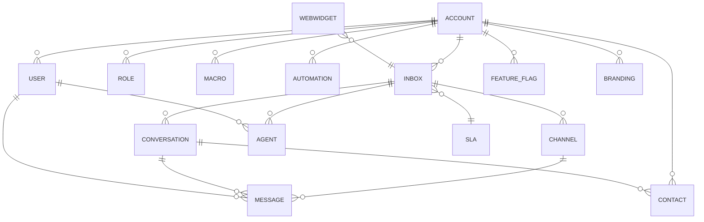

# Infográfico de Modelos – App Omnichannel Multitenant

## Visão Geral

Este infográfico apresenta a estrutura de dados central para um app de comunicação omnichannel, multiatendimento e multitenant, concorrente do Chatwoot. O design prioriza escalabilidade, isolamento de dados, flexibilidade e extensibilidade para múltiplos canais, automações e customizações por conta.

> **Nota:** Neste modelo, a entidade **Account** representa o Tenant (empresa/cliente), sendo a raiz de todo o isolamento e customização.

---

## Diagrama de Entidades e Relacionamentos


```

---

## Entidades Principais

- **Account**: Unidade máxima de isolamento (Tenant). Cada account representa uma empresa/cliente, com todos os recursos vinculados a ela.
- **User**: Usuários (agentes, admins, etc.) associados à account.
- **Role**: Permissões customizáveis por account.
- **Inbox**: Caixa de entrada multicanal (e-mail, WhatsApp, chat, etc.), associada à account.
- **Channel**: Tipos de canal (e-mail, WhatsApp, Messenger, etc.).
- **Conversation**: Fio de mensagens entre contato e agentes.
- **Message**: Mensagens individuais.
- **Contact**: Clientes/usuários finais.
- **Automation**: Regras automáticas (ex: atribuição, respostas automáticas).
- **Macro**: Respostas rápidas e ações em lote.
- **FeatureFlag**: Ativação de features por account.
- **Branding**: Customização visual por account.
- **WebWidget**: Widget de chat para sites.
- **SLA**: Acordos de nível de serviço criados no contexto da account, mas vinculados a uma ou mais inboxes.

---

## Diferenciais de Escalabilidade e Flexibilidade

- **Multi-Account (Tenant) Real**: Isolamento de dados e recursos por account, facilitando escalabilidade horizontal.
- **Omnichannel Modular**: Novos canais podem ser adicionados facilmente via Channel/Inbox.
- **Customização Profunda**: Branding, roles, feature flags e automações configuráveis por account.
- **Multiagente e Multiinbox**: Suporte a múltiplos agentes e múltiplas inboxes por account.
- **Automação e Macros**: Permite automações avançadas e respostas rápidas para ganho de produtividade.
- **SLA flexível**: SLAs podem ser criadas independentemente e vinculadas a uma ou mais inboxes, permitindo diferentes regras de atendimento por canal ou equipe.
- **WebWidget Integrável**: Widget de chat customizável para sites de clientes.

---

## Observações de Design

- **Escalabilidade**: Estrutura preparada para sharding, replicação e balanceamento de carga.
- **Extensibilidade**: Novas features podem ser plugadas sem impacto no core.
- **Segurança**: Isolamento rigoroso entre accounts, controle granular de permissões.
- **Performance**: Modelos otimizados para consultas rápidas e alta concorrência.

---

> **Este infográfico serve como base para discussões arquiteturais e futuras evoluções do projeto.** 